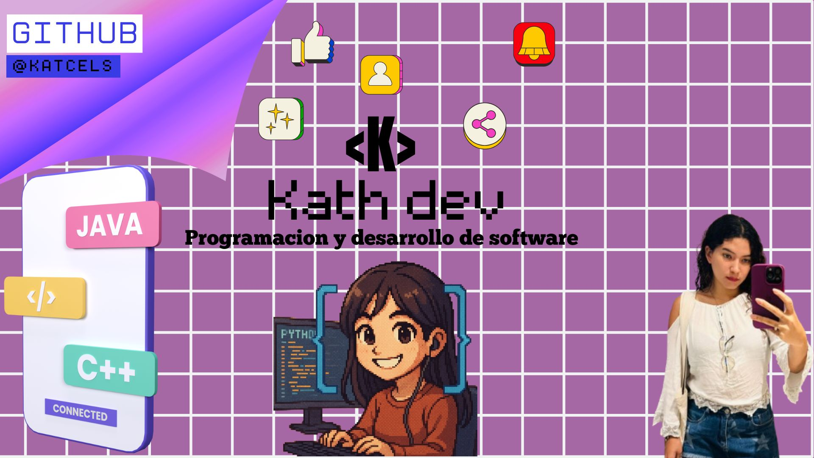

# %20(2)%20(1).png) Buenos dias, mi nombre es Katherine Camacho 👋
### Freelance fullstack engineer

Soy Tecnologa de Analisis y Desarrollo de Software, desde el 2024
Actualmente, soy estudiante de ingenieria de Software y Datos con un gusto orientado a la Inteligencia Artificial

He trabajado en distintos prtoyectos del secctor, creando [proyecto) en 2024 para dedicarme a desarrollar aplicaciones móviles y web a tiempo completo, llegando a colaborar con empresas de distintas partes del mundo.

Desde 2020 comienzo a crear contenido divulgativo sobre programación en redes sociales, compaginándolo con mi actividad como freelance. 
Mi objetivo es devolver todo el conocimiento que la comunidad ha compartido conmigo de forma gratuita a lo largo de los años, así como ayudar a que más personas puedan acceder a su estudio.

## Encuéntrame en:
 

 

# Algunos proyectos de la comunidad
## Python desde cero: Curso gratis

## JavaScript desde cero: Curso gratis

## Java desde cero: Curso gratis

## Git & GitHub desde cero: Curso gratis

## Algunos de mis proyectos en YouTube:

<table style="width:100%">
<tr>
<td>

</td>
<td>

</td>
<td>

</td>
</tr>
</table>

## Contacto y apoyo:

[_Gracias!-orange?style=for-the-badge&logo=Microsoft+Outlook&logoColor=white&labelColor=101010)](https://mypublicinbox.com/mouredev)
 
[-D14836?style=for-the-badge&logo=gmail&logoColor=white&labelColor=101010)](mailto:katherinecamacho12@gmail.com)
 

